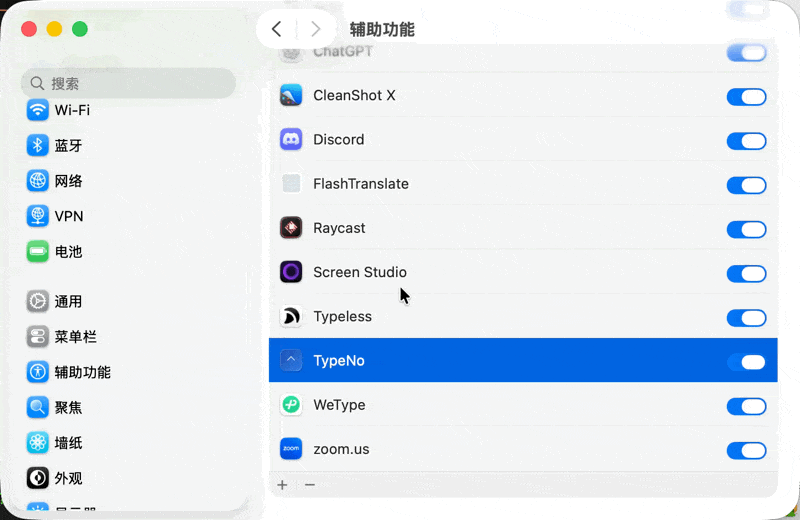

# TypeNo

[English](README.md) | [日本語](README_JP.md)

**免费、开源、隐私优先的 macOS 语音输入工具。**


一个极简的 macOS 语音输入应用。按下 Control 说话，TypeNo 在本地完成转录，然后自动粘贴到你正在使用的应用中——全程不到一秒。

官方网站：[https://typeno.com](https://typeno.com)

特别感谢 [marswave ai 的 coli 项目](https://github.com/marswaveai/coli) 提供本地语音识别能力。

## 使用方式

1. **短按 Control** 开始录音
2. **再短按 Control** 停止
3. 文字自动转录并粘贴到当前应用（同时复制到剪贴板）

就这么简单。没有窗口，没有设置，没有账号。

## 安装

### 方式一：直接下载

- [下载 TypeNo for macOS](https://github.com/marswaveai/TypeNo/releases/latest)
- 下载最新的 `TypeNo.app.zip`
- 解压后将 `TypeNo.app` 拖到 `/Applications`
- 打开 TypeNo

TypeNo 已通过 Apple 签名和公证，可以直接打开使用。

### 安装语音识别引擎

TypeNo 使用 [coli](https://github.com/marswaveai/coli) 进行本地语音识别：

```bash
npm install -g @marswave/coli
```

如果未安装 Coli，TypeNo 会在应用内弹出引导提示。

### 首次启动

TypeNo 需要两个一次性授权：
- **麦克风** — 录制你的声音
- **辅助功能** — 将文字粘贴到应用中

首次启动时，应用会自动引导你完成授权。

### 常见问题：辅助功能权限无效

部分用户在**系统设置 → 隐私与安全性 → 辅助功能**中开启 TypeNo 后仍无法使用——这是 macOS 的一个已知 bug。解决方法：

1. 在列表中选中 **TypeNo**
2. 点击 **−** 删除它
3. 点击 **+**，从 `/Applications` 重新添加 TypeNo



### 方式二：从源码构建

```bash
git clone https://github.com/marswaveai/TypeNo.git
cd TypeNo
scripts/generate_icon.sh
scripts/build_app.sh
```

应用位于 `dist/TypeNo.app`。移动到 `/Applications/` 以获得持久权限。

## 操作方式

| 操作 | 触发方式 |
|---|---|
| 开始/停止录音 | 短按 `Control`（< 300ms，不按其他键） |
| 开始/停止录音 | 菜单栏 → Record |
| 转录文件 | 拖拽 `.m4a`/`.mp3`/`.wav`/`.aac` 到菜单栏图标 |
| 检查更新 | 菜单栏 → Check for Updates... |
| 退出 | 菜单栏 → Quit（`⌘Q`） |

## 设计理念

TypeNo 只做一件事：语音 → 文字 → 粘贴。没有多余的 UI，没有偏好设置，没有配置项。最快的打字方式就是不打字。

## Star History

[](https://star-history.com/#marswaveai/TypeNo&Date)

## 许可证

GNU General Public License v3.0
